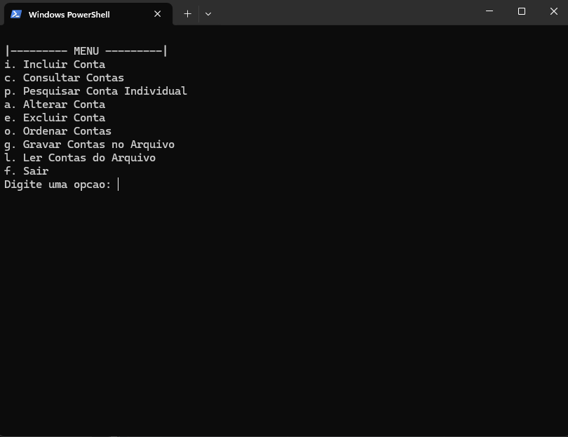
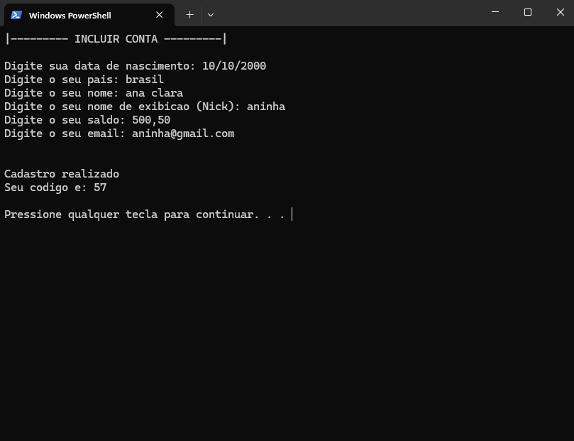
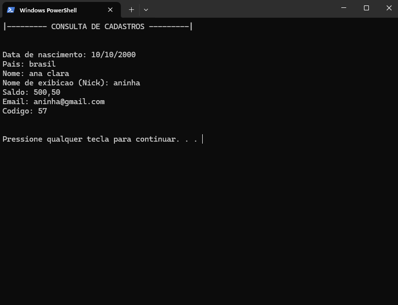
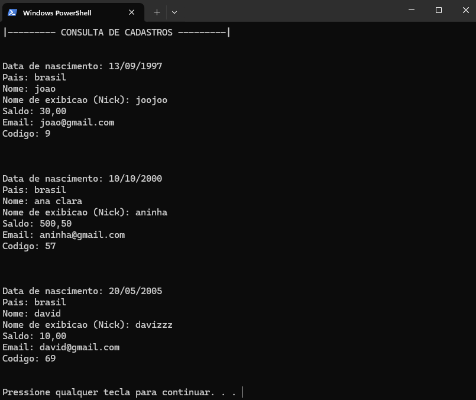

# Sistema de Cadastro em C

Projeto desenvolvido em C com foco em prática de lógica de programação, manipulação de arquivos binários e organização de sistemas em baixo nível.

O sistema implementa operações completas de CRUD (cadastro, consulta, alteração e exclusão), além de ordenação de registros utilizando QuickSort e persistência de dados em arquivo binário.

---

## Funcionalidades

- Cadastro de contas
- Consulta de registros
- Pesquisa individual
- Alteração de dados
- Exclusão lógica
- Ordenação de registros
- Persistência em arquivo binário

---

## Tecnologias Utilizadas

- Linguagem C
- Structs
- Manipulação de arquivos binários
- QuickSort
- Modularização em múltiplos arquivos
- Git e GitHub

---

## Estrutura do Projeto

```text
cadastro-c/
│
├── src/
│   ├── main.c
│   ├── cadastro.c
│   ├── arquivo.c
│   └── ordenacao.c
│
├── include/
│   ├── cadastro.h
│   ├── arquivo.h
│   ├── ordenacao.h
│   └── global.h
│
├── legacy/
│   └── programa 1.c
│
├── README.md
├── Makefile
└── .gitignore

# Aprendizados

Esse projeto foi importante para consolidar conceitos como:

lógica de programação
manipulação de arquivos
organização de dados com structs
separação de responsabilidades
modularização em C
ordenação de registros
uso de Git e GitHub

Durante a revisão e refatoração do projeto também identifiquei pontos importantes de melhoria relacionados a:

uso excessivo de variáveis globais
acoplamento entre módulos
segurança na entrada de dados
organização arquitetural
Melhorias Futuras
Reduzir dependência de variáveis globais
Melhorar modularização do sistema
Implementar validações mais robustas
Substituir scanf por abordagens mais seguras
Criar versão utilizando SQLite
Melhorar portabilidade entre sistemas operacionais
Adicionar testes automatizados

A versão original monolítica do projeto foi mantida na pasta legacy/ para fins de comparação e evolução arquitetural.

---

## Demonstração

### Menu principal



---

### Cadastro de contas



---

### Consulta de registros



---

### Ordenação dos registros

